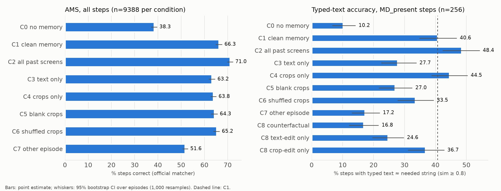
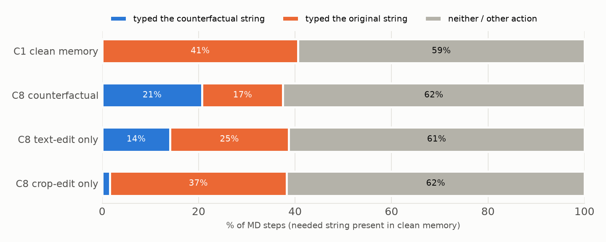

# Do GUI agents causally use their memory? — Final report

_MementoGUI-style intervention study on GUI-Odyssey. Princeton Adroit, 2026-10-02 → 2026-10-03. All numbers come from
`results/n600_summary_table.csv`, `results/n600_follow_table.csv` and `results/n600_per_step.parquet`; nothing was
tuned after seeing results except the one pre-full-run change documented in `reports/pilot.md` §4.3._

## TL;DR

* **Memory helps a lot, and on memory-dependent steps it helps because of its content.** Among memory-dependent (MD)
  steps whose needed string is in memory, clean memory (C1) types the right string 40.6% of the time vs 10.2% with no
  memory (C0). On strict MD steps (string not inferable from the instruction): 32.2% vs 0.7%.
* **Wrong-episode memory of the same form (C7) recovers little of that on MD steps** (17.2%; 4.6% strict), but **on all
  steps it recovers about half of the AMS gain** (C0 38.3 → C7 51.6 → C1 66.3). Much of the *overall* AMS benefit of memory
  is a presence/format effect: any memory-shaped context tells the agent it is mid-task, so it stops pressing Home or
  launching apps (`Launch` drops from 14.7% to 1.6% of actions).
* **The backbone causally follows edited memory content.** Swapping the needed string for a same-slot alternative in
  memory (C8) makes UI-Venus type the counterfactual on 20.7% [16.0, 25.5] of MD-present steps (about a third of the MD steps where it
  types at all), vs 0/256 under clean memory. Following runs mainly through the **text** channel (text-only edit 14.1%)
  rather than the crop channel (crop-only edit 1.6%).
* **Crop pixels matter, but mostly by shaping *whether* the agent types:** gray crops (C5) ≈ no crops (C3) ≈ 27% vs
  C1 40.6%; crops alone (C4) 44.5%. The pre-registered crop-only subset (n=10) is too small to test H3 directly.
* **Keeping all raw past screenshots (C2) beats our compressed memory** (AMS 71.0 vs 66.3; MD 48.4 vs 40.6) in this
  teacher-forced offline setting, the opposite of MementoGUI's reported ordering.

* **Follow-up (§9, 2026-10-05): give the backbone the list of past actions.** C1 had *replaced* the prompt's action
  history. Adding it back lifts every condition (C1 66.3 → 71.8; C2 71.0 → 76.6; actions alone 68.2), halves
  click-instead-of-type errors, and makes the content effect cleaner: with actions, wrong-episode memory now *hurts*
  (64.1 vs 68.2) while clean memory adds 26 points on strict MD (45.4 vs 19.7). The backbone also types 31.5% of
  never-seen strings exactly from priors, so MD accuracy must be read against the actions-only baseline.
* **Long-horizon follow-up (§10, 2026-10-06): does memory beat just keeping recent screenshots?** Tested on the 155
  longest GUI-Odyssey episodes and on MemGUI-3K (295 memory-intensive episodes), with screenshot baselines held to the
  memory's own pixel budget. **It depends on the task.** On long GUI-Odyssey, equal-budget screenshots match or beat our
  memory (MD-present, with actions: 67.1 vs 46.4) because they fix the interaction state and notes add distractor
  strings. On MemGUI-3K, where exact values must be carried across apps, memory wins clearly (strict MD with actions:
  50.6 vs 18.5; actions alone 9.9; other episode's memory 7.4) and edited values are followed (39.5% strict).
  Keeping all recent screenshots at full resolution stays best on overall step accuracy in both.

## 1. Setup

| Component | Choice |
|---|---|
| Backbone (frozen) | `inclusionAI/UI-Venus-1.5-8B` @ `a06ff6c6`, bf16, vLLM 0.30, greedy (T=0), max 768 new tokens |
| Backbone prompt | Official UI-Venus-1.5 "Mobile Prompt", verbatim from the tech report (arXiv 2602.09082v2, App. A.3); memory goes in its "### Previous Actions" slot; a `### Current Screenshot` header precedes the current screen in every condition |
| Controller (prompted, no training) | `Qwen/Qwen3-VL-8B-Instruct` @ `0c351dd0`; per step returns JSON {salience, write, summary ≤30 words, roi_bbox}; merges the two oldest entries when >8; ≤4 crops kept (most salient) |
| Memory construction | Ground-truth trajectories (teacher-forced); memory cached *before* each step, so the current screen never leaks |
| Data | GUI-Odyssey **v2** (`hflqf88888/GUIOdyssey` @ `61632d0f`, which the v1 card recommends), `random_split` test (1,666 eps); **600 episodes** stratified by category (seed 0), 9,388 steps |
| Scoring | Official GUI-Odyssey matcher (`GUIOdyssey_action_matching.py`, unmodified, uses `sam2_bbox`); "macro" = step accuracy, "micro" = mean over 6 categories |
| Statistics | 95% CIs: episode bootstrap, 1,000 resamples; exact McNemar tests (paired), C1 vs each condition |
| Hardware / compute | Adroit A40 (48 GB) and A100 (80 GB) GPUs; **11.4 GPU-hours** total (controller 1.7, backbone 9.5, pilot + checks 0.3); ~97 CPU-core-hours (OCR, condition building, analysis) |

### Conditions (all share the prompt and current screenshot; only the memory block differs)

C0 none · C1 clean notes + crops · C2 all past GT screenshots (most recent 20, 0.35 MP each) · C3 notes only ·
C4 crops only (notes → `[step k]`) · C5 crops → uniform gray, same size · C6 crops deranged within the memory (n/a on
857 steps with a single crop and no donor) · C7 memory of another sampled episode of the same category with matched entry
count (and crop count where possible), relabelled with the recipient's step labels · C8 (MD steps only) needed string →
same-slot alternative in notes **and** crops · C8t notes only · C8c crops only.

### Deviations from MementoGUI / from the spec (all decided before seeing full-run results)

1. **Not a reproduction:** no released code or weights; our controller is a *prompted* Qwen3-VL-8B, not a trained
   MementoCore. No episodic memory.
2. **Data version and split:** v2 with `random_split`; MementoGUI's protocol is unknown.
3. **Teacher-forced memory:** the controller walks the *ground-truth* trajectory (spec §4c), so C2 uses GT screenshots.
   MementoGUI's 66.31 "keep all" baseline used *predicted* history.
4. **Action mapping:** UI-Venus `Launch`, `Wait` and `PressEnter` have no GUI-Odyssey counterpart and always score wrong;
   `CallUser` → COMPLETE (or IMPOSSIBLE if it says the task is infeasible); `Drag` → SCROLL.
5. **MD definition:** added an `in_instruction` flag. **Strict MD** = the needed string is *not* in the instruction, so
   only memory can supply it. Results are reported for both definitions.
6. **Episode count:** n=300 gave 134 MD steps (<150), so the pre-specified extension to **600** was applied.
7. **C8 alternatives** (post-pilot change, before the full run): ranked by same task template, then same category, then
   any; must be dissimilar to the original and absent from the instruction and from every screen seen so far.
   203/275 same-template, 60 same-category, 11 digit perturbations, 1 any.

## 2. Label quality and memory presence

* **MD labels:** 275 MD steps in 245 of the 600 episodes; 164 strict. Hand-check of 30 random labels against the images
  (`reports/label_check.md`, contact sheets `reports/figs/md_label_check_*.png`): **precision 27/30 = 0.90**
  (Wilson 95% CI 0.74–0.97). Errors: OCR missing light text on coloured or dimmed backgrounds (the string *was* on the
  current screen; see also Case 3 below), stale browser history, and one loose fuzzy match.
* **Controller reliability:** 9,388 write decisions; 2 first-try JSON failures (0.02%), both fixed on retry; 0 final
  failures; 2/2,517 merges fell back to concatenation.
* **Presence rate** (is the needed string in clean memory at the MD step?): in the notes 89.5%, visible in a crop
  (crop OCR) 65.5%, **either 93.1% (256/275)**. Only 10 MD steps have the string in a crop but *not* in the notes
  ("crop-only").
* **Counterfactual edit quality:** after editing, the original string survives in the C8 memory text in 1/275 cases and
  in no unedited crop, so "typed the original" under C8 is not caused by leftover copies.

## 3. Main results

### Table 1. AMS on all steps (official matcher; 95% episode-bootstrap CI)

| Condition | n steps | AMS (macro) | AMS (micro) | change vs C1 % | C1-only / cond-only correct | McNemar p (vs C1) |
|---|---|---|---|---|---|---|
| C0 no memory | 9388 | 38.3 [37.1, 39.7] | 38.9 | 49.7 | 2884 / 263 | <0.001 |
| C1 clean memory | 9388 | 66.3 [64.9, 67.6] | 66.0 | 0.0 | — | — |
| C2 all past screens | 9388 | 71.0 [69.8, 72.3] | 70.7 | 24.1 | 502 / 951 | <0.001 |
| C3 text only | 9388 | 63.2 [61.9, 64.6] | 63.1 | 14.0 | 548 / 263 | <0.001 |
| C4 crops only | 9388 | 63.8 [62.6, 65.1] | 63.3 | 19.1 | 699 / 468 | <0.001 |
| C5 blank crops | 9388 | 64.3 [62.9, 65.6] | 64.1 | 11.4 | 431 / 244 | <0.001 |
| C6 shuffled crops | 8531 | 65.2 [63.8, 66.5] | 65.1 | 9.3 | 262 / 192 | 0.001 |
| C7 other episode | 9388 | 51.6 [50.5, 52.9] | 52.0 | 33.9 | 1765 / 391 | <0.001 |

### Typed-text accuracy on all MD steps

| Condition | n | text acc % | AMS % | predicts TYPE % | follows counterfactual % | C1-only / cond-only | McNemar p (vs C1) |
|---|---|---|---|---|---|---|---|
| C0 no memory | 275 | 9.5 [5.9, 12.8] | 10.9 | 19.6 | 0.0 | 87 / 7 | <0.001 |
| C1 clean memory | 275 | 38.5 [32.6, 44.4] | 46.5 | 56.7 | 0.0 | — | — |
| C2 all past screens | 275 | 48.0 [41.9, 53.7] | 53.1 | 64.7 | 0.0 | 17 / 43 | 0.001 |
| C3 text only | 275 | 26.9 [21.7, 32.0] | 33.1 | 42.5 | 0.0 | 35 / 3 | <0.001 |
| C4 crops only | 275 | 42.5 [36.8, 48.2] | 50.5 | 63.3 | 0.0 | 22 / 33 | 0.177 |
| C5 blank crops | 275 | 25.8 [21.0, 31.0] | 31.6 | 41.1 | 0.0 | 38 / 3 | <0.001 |
| C6 shuffled crops | 266 | 32.0 [26.3, 37.7] | 41.0 | 50.8 | 0.0 | 21 / 7 | 0.013 |
| C7 other episode | 275 | 16.0 [11.6, 20.5] | 19.3 | 32.7 | 0.4 | 67 / 5 | <0.001 |
| C8 counterfactual (text+crop) | 275 | 16.4 [11.7, 20.7] | 24.4 | 56.0 | 19.3 | 63 / 2 | <0.001 |
| C8t text-edit only | 275 | 23.6 [18.4, 28.7] | 30.5 | 56.0 | 13.1 | 44 / 3 | <0.001 |
| C8c crop-edit only | 275 | 34.9 [29.2, 40.5] | 43.3 | 54.2 | 1.5 | 12 / 2 | 0.013 |

### Typed-text accuracy on MD steps with the needed string present in clean memory

| Condition | n | text acc % | AMS % | predicts TYPE % | follows counterfactual % | C1-only / cond-only | McNemar p (vs C1) |
|---|---|---|---|---|---|---|---|
| C0 no memory | 256 | 10.2 [6.6, 14.2] | 11.3 | 19.5 | 0.0 | 85 / 7 | <0.001 |
| C1 clean memory | 256 | 40.6 [34.8, 46.9] | 48.8 | 57.8 | 0.0 | — | — |
| C2 all past screens | 256 | 48.4 [42.3, 54.3] | 53.5 | 64.5 | 0.0 | 17 / 37 | 0.009 |
| C3 text only | 256 | 27.7 [22.4, 33.8] | 34.0 | 42.2 | 0.0 | 35 / 2 | <0.001 |
| C4 crops only | 256 | 44.5 [38.7, 50.4] | 52.7 | 64.1 | 0.0 | 22 / 32 | 0.220 |
| C5 blank crops | 256 | 27.0 [21.7, 32.5] | 32.4 | 41.0 | 0.0 | 38 / 3 | <0.001 |
| C6 shuffled crops | 248 | 33.5 [27.8, 39.4] | 42.7 | 50.8 | 0.0 | 21 / 7 | 0.013 |
| C7 other episode | 256 | 17.2 [13.0, 22.0] | 19.5 | 32.4 | 0.4 | 65 / 5 | <0.001 |
| C8 counterfactual (text+crop) | 256 | 16.8 [12.0, 21.6] | 25.0 | 57.0 | 20.7 | 63 / 2 | <0.001 |
| C8t text-edit only | 256 | 24.6 [19.5, 29.8] | 31.6 | 57.0 | 14.1 | 44 / 3 | <0.001 |
| C8c crop-edit only | 256 | 36.7 [31.1, 42.9] | 45.3 | 55.1 | 1.6 | 12 / 2 | 0.013 |

### Typed-text accuracy on strict MD (string not in instruction) and present in memory

| Condition | n | text acc % | AMS % | predicts TYPE % | follows counterfactual % | C1-only / cond-only | McNemar p (vs C1) |
|---|---|---|---|---|---|---|---|
| C0 no memory | 152 | 0.7 [0.0, 2.0] | 1.3 | 13.2 | 0.0 | 48 / 0 | <0.001 |
| C1 clean memory | 152 | 32.2 [24.7, 40.9] | 39.5 | 51.3 | 0.0 | — | — |
| C2 all past screens | 152 | 38.2 [30.4, 45.7] | 43.4 | 56.6 | 0.0 | 11 / 20 | 0.150 |
| C3 text only | 152 | 19.7 [14.0, 26.2] | 25.0 | 33.6 | 0.0 | 20 / 1 | <0.001 |
| C4 crops only | 152 | 35.5 [28.1, 43.3] | 42.1 | 55.3 | 0.0 | 14 / 19 | 0.487 |
| C5 blank crops | 152 | 19.7 [13.4, 26.3] | 23.7 | 35.5 | 0.0 | 20 / 1 | <0.001 |
| C6 shuffled crops | 147 | 22.4 [16.1, 29.5] | 29.9 | 41.5 | 0.0 | 15 / 3 | 0.008 |
| C7 other episode | 152 | 4.6 [1.3, 8.2] | 5.9 | 23.7 | 0.0 | 43 / 1 | <0.001 |
| C8 counterfactual (text+crop) | 152 | 5.9 [2.0, 9.9] | 12.5 | 50.7 | 23.7 | 40 / 0 | <0.001 |
| C8t text-edit only | 152 | 17.8 [11.6, 25.0] | 23.0 | 50.0 | 11.8 | 23 / 1 | <0.001 |
| C8c crop-edit only | 152 | 25.0 [17.9, 32.5] | 33.6 | 46.7 | 2.6 | 12 / 1 | 0.003 |

### Follow table (C8 family vs C1 baseline)

| Condition | subset | n | typed counterfactual % [CI] | typed original % | neither % |
|---|---|---|---|---|---|
| C1 clean memory | MD_with_cf | 275 | 0.0 [0.0, 0.0] | 38.5 | 61.5 |
| C1 clean memory | MD_present_with_cf | 256 | 0.0 [0.0, 0.0] | 40.6 | 59.4 |
| C8 counterfactual (text+crop) | MD_with_cf | 275 | 19.3 [14.9, 24.2] | 16.4 | 64.4 |
| C8 counterfactual (text+crop) | MD_present_with_cf | 256 | 20.7 [16.0, 25.5] | 16.8 | 62.5 |
| C8t text-edit only | MD_with_cf | 275 | 13.1 [9.2, 17.2] | 23.6 | 63.3 |
| C8t text-edit only | MD_present_with_cf | 256 | 14.1 [10.0, 18.4] | 24.6 | 61.3 |
| C8c crop-edit only | MD_with_cf | 275 | 1.5 [0.4, 2.9] | 34.9 | 63.6 |
| C8c crop-edit only | MD_present_with_cf | 256 | 1.6 [0.4, 3.2] | 36.7 | 61.7 |

Text accuracy = predicted TYPE text with normalized edit similarity ≥ 0.8 to the needed string; any non-TYPE prediction
counts as wrong. The crop-only subset (n=10) is omitted from the tables: every condition except C4 (3/10) and C6 (0/9)
scores 1/10 there.

## 4. Pre-registered hypotheses

| | Prediction | Verdict | Evidence (MD-present subset unless noted) |
|---|---|---|---|
| **H1** memory helps | C1 > C0 on MD steps by a clear margin | **Supported** | text acc 40.6 vs 10.2 (85 vs 7 discordant, p < 0.001); strict 32.2 vs 0.7 (48 vs 0) |
| **H2** content, not presence | C7 ≈ C0 and C7 ≪ C1 on MD | **Mostly supported, with a qualification** | C7 ≪ C1: 17.2 vs 40.6 (65 vs 5, p < 0.001). C7 ≈ C0 holds only approximately: C7 > C0, 17.2 vs 10.2 (25 vs 7, p = 0.002); strict 4.6 vs 0.7 (6 vs 0, p = 0.03). C7 recovers ~23% of the C1−C0 gap on MD (12% strict). **On all steps, though, C7 recovers ~48% of the AMS gap** (38.3 → 51.6 → 66.3): a large presence/format effect on overall AMS (§5.1) |
| **H3** pixels matter | C5 < C1 on MD steps whose string is only in a crop | **Not testable as pre-registered** (n = 10, both 1/10). Indirect evidence supports it | Gray crops = no crops: C5 27.0 ≈ C3 27.7 < C1 40.6 (38 vs 3, p < 0.001); crops alone C4 44.5 ≥ C1 (p = 0.22); shuffled crops C6 33.5 < C1 (p = 0.013). So crop *content* matters, not just image presence |
| **H4** causal following | C8 follow rate ≫ rate of the cf string under C1 (~0) | **Supported** | C8 types the counterfactual on 20.7% [16.0, 25.5] vs 0/256 under C1; 34% of the MD steps (all MD) where it types; strict 23.7%. Text-only edit 14.1% [10.0, 18.4]; crop-only edit 1.6% [0.4, 3.2] |

## 5. Further findings

### 5.1 What the "presence" effect is
Without memory the backbone behaves as if every screen were the start of a task: on all steps, C0 predicts
`Launch(app)` 14.7% of the time (never correct under the GUI-Odyssey action space), PRESS_HOME 17.6% (GT 7.8%), and
almost never COMPLETE (0.1%; accuracy on GT-COMPLETE steps 0.7%). Any memory block, even another episode's (C7), removes
most of this (`Launch` 1.6%, PRESS_HOME 10.0%). That alone accounts for much of C7's +13 AMS points over C0. Correct
task *termination* does need the right content: GT-COMPLETE accuracy is C7 16.0% vs C1 59.2% vs C2 69.3%.
**Implication:** headline AMS gains from adding memory (MementoGUI's 54.58 → 68.32) conflate a large generic
"you are mid-task" effect with content use; content-sensitive tests such as C7/C8 are needed to tell them apart.

### 5.2 Why clean memory is "only" 40% on MD steps
The needed string is present in 93% of these memories, but C1 predicts TYPE on only 57.8% of MD-present steps. Almost all
other predictions are CLICKs (114 of 119 non-TYPE predictions on MD steps). In the cases we inspected (e.g. Case 6) they
tap the input field, i.e. the model wants to focus the field first while the GT trajectory types directly; we have not
measured how often this holds overall. **When C1 does type on an MD step, it types the right string 67.9% of the time**
(C0: 48%, mostly instruction-derivable strings). This step-granularity mismatch lowers all conditions, but the paired
comparisons between conditions remain valid.

### 5.3 Which channel carries the content
* Notes vs crops: notes-only (C3) 27.7, crops-only (C4) 44.5, both (C1) 40.6. Crops alone are at least as good as
  both together, partly because crops raise the TYPE rate (C4 64% vs C3 42%).
* Counterfactual channel: editing the **notes** moves the action (C8t 14.1% follow) far more than editing the **crops**
  (C8c 1.6%). When the channels conflict, the unedited channel wins more often than the edited one (C8t: original 24.6%
  vs cf 14.1%; C8c: original 36.7% vs cf 1.6%). Editing both gives the most following (20.7%), with the original still
  typed on 16.8%.
* Where does the "original" come from under full C8, given that it no longer appears in memory? Mostly the instruction:
  on strict MD, C8 types the original only 5.9% of the time (vs 16.8% on all MD-present), and the residual cases match the
  label-noise pattern of Case 3 (string actually visible on the current screen).

### 5.4 Compressed memory vs raw history
C2 (up to 20 raw past screenshots at 0.35 MP) beats C1 on all steps (71.0 vs 66.3) and on MD-present (48.4 vs 40.6,
p = 0.009; strict 38.2 vs 32.2, p = 0.15). In this teacher-forced setting raw history is a strong baseline; a prompted
8B controller's compression loses information that the backbone can extract itself from screenshots. MementoGUI reports
the opposite ordering with a trained controller and predicted history; we cannot test which factor explains the
difference.

### 5.5 Calibration against the paper (protocols differ; no tuning)

| | ours | MementoGUI | likely reasons for the gap |
|---|---|---|---|
| no history (C0) | 38.3 (micro 38.9) | 54.58 | `Launch` predictions (14.7% of steps, always wrong under our mapping), unknown prompt/history format and split |
| keep-all history (C2) | 71.0 (micro 70.7) | 66.31 | ours is GT (teacher-forced) history, theirs predicted |
| working memory (C1) | 66.3 (micro 66.0) | 68.32 (working + episodic) | prompted vs trained controller, no episodic memory |

Hardware check: AMS on A40 vs A100 shards differs by < 1 point in every condition checked (C0 38.2/38.5, C1 66.5/66.0,
C7 51.9/51.3).

## 6. Annotated cases (`reports/figs/case_01..10.png`; MD steps with the string in memory)

| # | Case | What happens |
|---|---|---|
| 1 | Follows (ep 3931941247679980, step 10). Task: find a graphic-designer job on Indeed, note the company in Word | The company "Innomark Communications" exists only in memory (strict). C1/C2/C3/C5 type it; C0 tries `Launch`; C7 clicks. C8/C8t type the counterfactual "Yoh, A Day & Zimmermann Company"; C8c (crop edited, notes intact) keeps the original. |
| 2 | Follows despite instruction (ep 8389643316825786, step 13) | Task says "uninstall the eBay app…". Every condition types "eBay", but with edited notes (C8, C8t) the model types "Zoom". **Memory text overrides the task instruction.** |
| 3 | Ignores edit: label error (ep 1289544280958962, step 2) | "do yoga in the morning" is faintly visible on the current screen behind a dimmed dialog (OCR missed it), and implied by the task. All conditions type it, so this is an MD false positive, not a failure to follow. |
| 4 | Ignores edit: generic label (ep 2939003719254124, step 26) | Alarm label "Meeting" for a task that says "arrange a business meeting… set an alarm". The edit replaced "meeting" in the notes, but the label is inferable from the task. C2 instead types the meeting title "Business". |
| 5 | C1 "wrong" on an ambiguous task (ep 1839248876158073, step 7) | "Download one of the apps mentioned in the video": GT chose Fitbod; memory records a "peloton app" search, so the model types Peloton. A defensible choice, scored wrong. |
| 6 | C1 clicks instead of typing (ep 2195224081720901, step 10) | GT types "Hong Kong" into a weather search; most conditions tap the field (§5.2). Under the edit (C8/C8t) the model types "Tai Po", another place name still in memory, rather than the out-of-slot alternative "coding class". |
| 7 | C7 right because of the instruction (ep 2563343411906526, step 15) | "painting class" is in the task text; every condition with memory types it, including C7 and all C8 edits. C0 clicks (doesn't know it is at the reminder step). This is why strict MD matters. |
| 8 | Same (ep 3376933091689373, step 2) | "REVOLVE" is in the task; every condition, including C0, is correct. |
| 9 | C0 right (ep 8861541257773326, step 9) | "The Renaissance" is in the task; memory is redundant. |
| 10 | Crop edit followed (ep 2631230393088092, step 9) | Rare (4/275): with only the **crop** edited ("Jobot" → "Entertainment Retail Enterprise, LLC") and the notes still saying Jobot, the model types the crop's (edited) company. Crop content *can* drive the action. |

## 7. Limitations

* **Label noise:** MD precision 0.90; the main error mode (string actually on screen) biases MD accuracies *upward* for
  all conditions and slightly lowers follow rates.
* **Small subsets:** MD-present n = 256 and strict n = 152 give CIs of ±5–8 points; the crop-only subset (n = 10)
  cannot test H3 as pre-registered.
* **Offline, teacher-forced evaluation:** memory is built from ground-truth trajectories and each step is scored
  independently; there is no closed-loop error accumulation, which favours raw history (C2).
* **Prompted controller:** our memory is noisier and less selective than a trained MementoCore; conclusions about how
  the backbone *uses* memory don't depend on controller quality, but conclusions about how *useful* MementoGUI's memory
  is do.
* **Action-space mismatch:** UI-Venus actions without GUI-Odyssey counterparts (`Launch` etc.) are always wrong, which
  depresses C0 most; tapping-before-typing granularity depresses MD accuracy for all conditions.
* **Single model, single seed, greedy decoding**, mixed A40/A100 hardware (no detectable effect).
* **Counterfactual realism:** same-template alternatives are plausible but not guaranteed semantically valid in context
  (e.g. "Los Angeles" → "California"); rendered crop text is a near but imperfect font match.

## 8. Compute and reproducibility

**11.4 GPU-hours** (controller 1.67, backbone 9.46, pilot 0.28, engine check 0.02) and ~97 CPU-core-hours
(`scripts/gpu_hours.py`). Wall time was dominated by queueing.
Code, revisions and the run guide: `README.md`, `CONTEXT.md`, `results/provenance.json`. Pipeline:
`scripts/setup_env.sh` → `scripts/download.sh` → `slurm/controller.sbatch 600` → `slurm/build_conditions.sbatch 600` →
`slurm/backbone.sbatch 600` → `slurm/analyze.sbatch 600` → `python -m src.figures` → `python -m src.failure_cases`.
Per-step results: `results/n600_per_step.parquet` (75,072 rows: episode × step × condition with raw output, parsed
action, official correctness, text similarities, presence flags).

Optional §7 of the spec (activation patching) was not run.

## 9. Follow-up 1 (2026-10-05): adding the action trace

**Why.** In C1 the memory block *replaces* the prompt's "### Previous Actions" slot. The controller sees the previous
GT action when it writes a note, but its notes describe screens (13% of entries mention an action verb), so the
backbone never learns which actions were taken. The failure analysis pointed to exactly that: on GT-TEXT steps C1
clicks instead of typing 39.5% of the time (often reasoning "click the search bar to start typing <the right string>"),
and on GT-COMPLETE steps it clicks 183 times.

**Conditions** (`src/action_trace.py`; built from the frozen main-study specs, so memory contents, C7 donors and C8
edits are identical; one pre-specified run on the same 600 episodes, nothing tuned). The block
`Actions taken so far: [step k] <GT action in UI-Venus syntax>` is added to the same slot:
A0 actions only · A1 C1 + actions · A2 C2 screenshots each followed by its action · A7 C7 (other episode) + the
recipient's own actions · A8 C8 + actions, with the needed string also replaced in earlier `Type(...)` actions
(original survives in 1/275 histories, as in C8). 4.9 GPU-hours.

### Table 9a. AMS on all steps (95% episode-bootstrap CI)

| | without actions | with actions |
|---|---|---|
| no memory | C0 38.3 [37.1, 39.7] | **A0 68.2** [67.2, 69.4] |
| clean memory | C1 66.3 [64.9, 67.6] | **A1 71.8** [70.5, 73.0] |
| all past screenshots | C2 71.0 [69.8, 72.3] | **A2 76.6** [75.5, 77.7] |
| other episode's memory | C7 51.6 [50.5, 52.9] | **A7 64.1** [63.0, 65.3] |

### Table 9b. Typed-text accuracy on MD steps with the string in memory (paired exact McNemar, `results/n600_at_paired.csv`)

| | MD-present (n=256) | strict MD-present (n=152) |
|---|---|---|
| C1 clean memory | 40.6 | 32.2 |
| A0 actions only | 40.2 [34.2, 46.2] | 19.7 [13.2, 27.2] |
| A1 memory + actions | **53.5** [47.8, 59.6] | **45.4** [37.7, 53.9] |
| A2 screenshots + actions | **64.1** [58.5, 69.4] | **57.9** [50.0, 65.4] |
| A7 other episode + actions | 36.7 [30.9, 42.5] | 16.4 [10.7, 22.6] |
| A1 vs A0 | 56 vs 22 discordant, p = 1e-4 | 49 vs 10, p = 3e-7 |
| A7 vs A0 | 9 vs 18, p = 0.12 | 4 vs 9, p = 0.27 |
| A1 vs A7 | 61 vs 18, p = 1e-6 | 50 vs 6, p = 1e-9 |

**Findings.**
1. **Knowing what was done fixes much of the state error.** TEXT steps predicted as CLICK: C1 39.5% → A1 19.8%
   (C2 27.7% → A2 11.8%). COMPLETE accuracy: C1 59.2 → A1 66.9, C2 69.3 → A2 88.5. Late steps no longer decay
   (steps 20+: C1 57.5, A1 64.7, A2 71.5). Actions alone (A0, 68.2) already beat our memory notes alone (C1, 66.3).
2. **With actions, the presence effect disappears and wrong memory hurts.** Without actions, another episode's memory
   added 13 AMS points over none (C7 vs C0). With actions, it *costs* 4 points (A7 64.1 vs A0 68.2; 362 vs 752
   discordant) and does not help MD steps (A7 vs A0, p = 0.12 / 0.27). Clean memory adds 3.5 AMS points over actions
   alone and **26 points on strict MD** (A1 45.4 vs A0 19.7). H2 ("content, not presence") is cleaner once the
   backbone knows what it has done.
3. **Causal following persists and grows:** A8 types the counterfactual on 25.4% [20.5, 30.4] of MD-present steps
   (C8 20.7%; 16 vs 4 discordant, p = 0.012) and 32.9% of strict MD-present steps (C8 23.7%, p = 5e-4).
4. **Raw history still wins:** A2 > A1 on every metric (AMS 76.6 vs 71.8; strict MD 57.9 vs 45.4, p = 0.004).
5. **Memory notes can crowd out the screen:** on TYPE steps whose string is visible on the current screen (n = 86),
   A1 types it exactly 47.7% of the time vs A0 64.0% (`results/n600_at_prior_table.csv`).

Leakage checks: copying the previous GT action happens at its base rate (8–9% vs GT repeat rate 7.9%) and the gains
hold when repeats are excluded; the needed string is in the clean action trace on only 25/256 MD-present steps and the
gains hold on the other 231 (A1 52.8 vs C1 39.8).

### 9.1 The backbone types many strings from priors (`src/prior_knowledge.py`)

Every GT TYPE step (n = 982 with ≥ 3 characters) was assigned the first source that contains its string:
instruction (484), current screen (86), earlier screen/typed text only (= strict MD, 164), or **seen nowhere** (248:
in no input up to that step). Exact (normalised) match rates:

| source | C0 | C1 | C2 | A0 | A1 | A2 | A7 |
|---|---|---|---|---|---|---|---|
| in instruction | 33.5 | 54.5 | 66.5 | 72.1 | 70.9 | 80.6 | 66.5 |
| on current screen | 18.6 | 25.6 | 54.7 | 64.0 | 47.7 | 67.4 | 55.8 |
| earlier only (strict MD) | 0.6 | 25.0 | 32.3 | 18.9 | 37.8 | 49.4 | 14.6 |
| **seen nowhere** | 13.7 | 24.6 | 34.3 | **31.5** | 36.7 | 39.1 | 29.8 |

With actions only, UI-Venus types **31.5% of never-seen strings exactly**, e.g. "Russian Learning", "book about
poetry", "10 mins per day", song lyrics named by the task ("We were both young when I first saw you"), and a full
chocolate-chip-cookie ingredient list. These look like world knowledge plus GUI-Odyssey's task-template conventions
rather than verbatim recall of episodes: dataset typos are *not* reproduced ("Italin Learning" → "Italian Learning",
"prosche" → "Porsche"), and template values are sometimes slightly off ("MAY 19" for "MAY 18", which the 0.8 fuzzy
threshold still counts as correct). GUI-Odyssey is not named in the UI-Venus-1.5 report's data list (which ends
"30+ sources … and so on"), so training exposure can be neither confirmed nor excluded. Part of "seen nowhere" will
also be OCR misses.

**Consequences for the main study.** (i) "Strict MD" means "not visible in the inputs", not "only memory can supply
it": A0 solves 19.7% of strict MD-present steps without any memory. C0 scored 0.7% there mainly because it rarely
types (13%); it often names the string in its reasoning and then clicks. (ii) The clean test of memory *content* is
A1 vs A0 vs A7 (all with actions), and it is strongly positive (§9 Table 9b). (iii) The C8/A8 follow results are
unaffected, since the counterfactual strings are not what priors would produce (0/256 under C1/A1).

### 9.2 Updated limitations
* C1 replaced the backbone's native action history rather than adding to it; the MementoGUI-style comparison
  (C0 vs C1) therefore mixes "memory" with "any history". A0 is the fair no-memory baseline.
* The action trace is the GT trajectory (teacher-forced), the best case for an action list.
* MD accuracies include prior-knowledge guesses; report them against A0.
* Compute for the follow-up: 4.9 GPU-hours (3 shards A100, 1 shard A40); total project 16.3 GPU-hours.

Next steps (design only, not run): within-episode task-graph memory with structural interventions
(`docs/graph_memory_design.md`); related work snapshot in `docs/related_work.md`.

## 10. Long-horizon follow-up (2026-10-06): long tasks and screenshots under the memory's budget

**Why.** C2 (raw past screenshots) beat our memory, but the comparison favoured C2 in two ways: it gets ~7× the
pixels of past images per step (2.62 vs 0.39 MP, 40 sampled episodes) and GUI-Odyssey episodes (median 14 steps) rarely
outgrow its 20-screenshot window, so the regime a memory is built for never occurs. Two tests, designed and
pre-registered in `LOG.md` before any result: (1) screenshot baselines held to the memory's visual budget, (2) longer
tasks. Everything else (prompt, backbone, controller, metrics, statistics) is unchanged.

### 10.1 Data

* **`odylong`**: all 155 GUI-Odyssey `random_split` test episodes with ≥ 25 steps (4,668 steps; 131 Multi_Apps). 55 of
  them were in the n=600 sample and reuse its controller caches. 148 MD steps (67 strict); needed string present in
  memory on 94.6%.
* **`memgui`**: the MemGUI-3K test split (`lgy0404/MemGUI-3K` @ `003822b5`, Apache-2.0; arXiv 2606.19926), 295
  episodes on 26 English Android apps, built to need memory across steps and apps. Trajectories are *teacher rollouts*
  of the MemGUI-Agent model (not human), released after UI-Venus-1.5. `src/memgui.py` converts them: ground truth =
  the step's `<tool_call>` (0–1000 coordinates, verified visually); the agent's 334 `memory_*` context actions and 4
  steps without a tool call are dropped (7,958 steps; median 22, p90 50, max 115); steps the dataset's evaluator marked
  unreasonable stay in the history but are not scored (6,146 scored). New GT types PRESS_ENTER / WAIT / ANSWER are
  scored by the official matcher's type-match rule, clicks by distance (≤ 0.14; no element boxes), and UI-Venus
  `CallUser` counts as ANSWER. MD labels also cover ANSWER steps. 238 MD steps (144 strict); string present in memory
  on only 67.6%. Pilot fix: the teacher's `<ui_observation>` describes the screen *after* the action, so it is not used
  for the "visible on the current screen" check (OCR only).

### 10.2 Conditions (glossary of everything in this report)

Every condition uses the same UI-Venus prompt and current screenshot; only the "### Previous Actions" slot differs.

| ID | What the backbone gets about the past | Question it answers |
|---|---|---|
| C0 | nothing | no-history baseline |
| C1 | our memory: ≤ 8 notes `[step k] summary` + ≤ 4 crops | MementoGUI-style memory |
| C2 | the 20 most recent past screenshots (0.35 MP each) | keep-everything baseline |
| **C2b** | the *n* most recent past screenshots, *n* = number of crops C1 has at that step, shrunk so their total pixels equal C1's crops (no notes) | same images, same pixels as memory: is selecting + summarising better than just keeping recent screens? |
| **C2w** | the 4 most recent past screenshots at 0.35 MP | the usual sliding window, with C1's image cap |
| C3 | C1 notes, no crops | do crops matter? |
| C4 | C1 crops, notes replaced by `[step k]` | do notes matter? |
| C5 | C1 with crops painted gray | crop pixels vs image presence |
| C6 | C1 with crops shuffled between notes | note–crop alignment (not run in follow-up 2) |
| C7 | memory of another episode, same form | content vs presence |
| C8 / C8t / C8c | MD steps: needed string swapped for an alternative in notes+crops / notes / crops | does the agent follow edited memory? |
| A0 | the list of past actions `[step k] Click(...)` | no-memory baseline with action history |
| A1 | C1 + action list | memory with action history |
| A2 | C2 screenshots, each followed by its action (older actions as text) | keep-everything with actions |
| **A2b** | C2b screenshots, each followed by its action, plus all older actions as text | equal-budget screenshots with actions |
| **A3** / **A5** | C3 / C5 + action list | do crops still matter once actions are given? |
| A7 / A8 | C7 / C8 + action list | content effect / following with actions |

Pre-registered predictions: **L1** at matched pixels memory beats screenshots on MD steps (C1 > C2b, A1 > A2b);
**L2** the crop effect shrinks once actions are given; **L3** the content effect replicates (A1 > A7, C8 follow > 0);
**L4** (exploratory) the C2 − C1 gap is smaller on long episodes.

### 10.3 Results: long GUI-Odyssey episodes (`runs/odylong/results/n155_*`, `runs/long_compare_*.csv`)

Sanity: INVALID ≤ 0.02%, no truncated outputs, step-0 prompts identical to C0 in every condition, C8/A8 rows only on MD
steps, C0 `Launch` 16% (as in the main study).

**Table 10a. AMS on all 4,668 steps and text accuracy on MD steps with the string in memory (95% episode-bootstrap CI)**

| | AMS all steps | MD-present (n=140) | strict MD-present (n=63) |
|---|---|---|---|
| C0 nothing | 34.4 [32.7, 36.5] | 13.6 [8.5, 19.6] | 0.0 |
| C1 memory | 62.0 [59.8, 64.0] | 35.7 [28.0, 43.6] | 20.6 [11.8, 30.0] |
| C2 last 20 screenshots | **68.7** [66.6, 70.6] | 48.6 [40.9, 56.6] | 34.9 [23.4, 45.8] |
| C2b screenshots, C1's budget | 61.1 [58.9, 63.2] | 47.9 [40.4, 55.9] | 20.6 [11.7, 31.0] |
| C2w last 4 screenshots | 63.7 [61.5, 65.7] | 48.6 [40.9, 56.6] | 30.2 [19.7, 42.1] |
| C3 notes only | 59.2 [57.2, 61.2] | 28.6 [21.3, 36.0] | 17.5 [9.5, 26.2] |
| C5 gray crops | 59.7 [57.7, 61.8] | 31.4 [24.5, 38.9] | 15.9 [7.9, 25.9] |
| C7 other episode | 48.8 [47.1, 50.6] | 16.4 [11.0, 22.6] | 0.0 |
| A0 actions only | 67.5 [65.7, 69.1] | 52.1 [44.9, 60.0] | 25.4 [15.3, 34.8] |
| A1 memory + actions | 68.3 [66.3, 70.0] | 46.4 [39.2, 53.8] | 34.9 [24.6, 45.0] |
| A2 screenshots + actions | **73.5** [71.9, 75.3] | **68.6** [61.2, 75.6] | **60.3** [48.4, 71.4] |
| A2b budget screenshots + actions | 73.1 [71.5, 74.8] | 67.1 [59.1, 74.3] | 49.2 [36.7, 60.9] |
| A3 notes only + actions | 66.9 [65.1, 68.7] | 47.1 [40.0, 54.6] | 34.9 [24.6, 45.9] |
| A5 gray crops + actions | 67.8 [66.0, 69.5] | 47.9 [40.3, 55.5] | 34.9 [24.2, 46.2] |
| A7 other episode + actions | 63.2 [61.4, 64.9] | 42.9 [35.0, 50.3] | 20.6 [12.1, 29.4] |

Follow rates (MD-present, n=140): C8 17.1% [11.2, 24.1], C8t 12.9%, **C8c 0.0%**, A8 20.7% [14.5, 27.8]; C1/A1 0%.

**Verdicts** (paired exact McNemar; differences with episode-bootstrap CIs):

* **L1 not supported — at equal pixels, recent screenshots match or beat our memory.** MD-present: C2b 47.9 vs C1 35.7
  (28 vs 11 discordant, p = 0.009); A2b 67.1 vs A1 46.4 (36 vs 7, p < 0.001). Strict: C2b = C1 (20.6, 9 vs 9); A2b 49.2
  vs A1 34.9 (16 vs 7, p = 0.09). All steps: C2b ≈ C1 (61.1 vs 62.0, p = 0.18), C2w > C1 (63.7, p = 0.009), A2b > A1
  (73.1 vs 68.3, 461 vs 234, p < 0.001).
  *Checked:* the screenshots do not win by showing the string. C2b is right on 50.0% of MD-present steps whose source
  screen is *outside* its window (n=86) and 44.4% when it is inside (n=54). What they do instead: (i) they raise the
  rate of typing at all (C1 57.9% → C2b 66.4%; A1 77.9% → A2b 88.6%), the click-instead-of-type failure of §5.2/§9;
  (ii) memory notes **distract** when the backbone does type: on MD steps whose string is in the instruction (n=77),
  accuracy given TYPE is 74.0% (C1) and 68.3% (A1) vs 91.5% (C2b) and 91.9% (A0). Note texts supply competing strings.
* **L2 supported, weakly.** Without actions, crops help (C1 vs C3 on MD-present 35.7 vs 28.6, 15 vs 5, p = 0.04); with
  actions they do not (A1 vs A3 46.4 vs 47.1, 7 vs 8; A1 vs A5 46.4 vs 47.9). Difference-in-differences 7.9 points
  [0.0, 15.8]; on all steps 1.4 [0.5, 2.5]. Consistent with the crop effect being mostly "you are about to type".
* **L3 partly supported.** Content matters only on strict steps: A1 34.9 vs A7 20.6 (13 vs 4, p = 0.049), C1 20.6 vs
  C7 0.0 (13 vs 0). On MD-present, actions-only A0 (52.1) is *above* A1 (46.4; 24 vs 16, p = 0.27). Edited memory is
  still followed (C8 17.1%, A8 20.7%), only through the notes: crop-only edits are never followed (0/140).
* **L4 opposite.** The keep-everything advantage grows on long episodes: C2 − C1 = 6.7 points vs 4.8 on the n=600
  sample (difference 1.9 [0.5, 3.4]). By step index (C1 / C2 / A1 / A2): steps 0–9 65.9 / 69.9 / 72.1 / 74.4, steps 20–29
  60.7 / 69.8 / 67.2 / 73.7, steps 30–39 49.6 / 59.5 / 56.3 / 64.4 (`runs/long_compare_steps.csv`).

### 10.4 Results: MemGUI-3K (`runs/memgui/results/n295_*`)

Sanity: INVALID ≤ 0.02%, no truncated outputs, step-0 prompts identical to C0, C8/A8 only on MD steps. C0 predicts
`Launch` on 37.5% of steps (episodes start on the home screen; the reference opens apps by tapping), so C0 is
especially low. Controller: 1 final write failure and 8 merge fallbacks in ~7,960 calls.

**Table 10b. AMS on all 6,146 scored steps and text accuracy on MD steps with the string in memory**

| | AMS all steps | MD-present (n=161) | strict MD-present (n=81) |
|---|---|---|---|
| C0 nothing | 23.5 [21.8, 25.2] | 3.1 [0.7, 6.2] | 1.2 [0.0, 4.2] |
| C1 memory | 51.4 [49.5, 52.9] | 31.7 [24.3, 39.1] | **27.2** [17.5, 37.2] |
| C2 last 20 screenshots | **54.3** [52.4, 56.1] | 28.0 [20.4, 35.3] | 18.5 [8.5, 28.9] |
| C2b screenshots, C1's budget | 48.6 [46.7, 50.5] | 24.2 [17.2, 31.2] | 2.5 [0.0, 6.6] |
| C2w last 4 screenshots | 51.3 [49.4, 53.2] | 24.8 [17.2, 31.9] | 4.9 [1.1, 10.7] |
| C3 notes only | 48.6 [46.7, 50.1] | 21.1 [15.1, 28.1] | 21.0 [12.0, 30.9] |
| C5 gray crops | 50.0 [48.3, 51.5] | 21.1 [15.2, 28.1] | 22.2 [13.0, 31.7] |
| C7 other episode | 37.1 [35.4, 38.8] | 7.5 [3.7, 12.1] | 2.5 [0.0, 6.1] |
| A0 actions only | 54.6 [52.8, 56.4] | 34.8 [25.6, 43.2] | 9.9 [3.8, 16.9] |
| A1 memory + actions | 59.2 [57.3, 61.0] | 58.4 [49.1, 67.8] | **50.6** [36.1, 65.4] |
| A2 screenshots + actions | **62.4** [60.6, 64.1] | **61.5** [53.3, 68.8] | 44.4 [30.9, 56.3] |
| A2b budget screenshots + actions | 60.0 [58.2, 61.7] | 47.2 [37.9, 55.6] | 18.5 [10.5, 26.8] |
| A3 notes only + actions | 57.1 [55.2, 59.0] | 51.6 [42.2, 60.7] | 38.3 [25.0, 52.9] |
| A5 gray crops + actions | 58.2 [56.4, 60.0] | 53.4 [43.9, 62.1] | 42.0 [28.4, 55.9] |
| A7 other episode + actions | 53.5 [51.8, 55.2] | 37.9 [28.9, 46.3] | 7.4 [2.4, 13.5] |

Follow rates (MD-present, n=161): C8 11.2% [6.6, 16.6], C8t 9.3%, C8c 1.2%, **A8 21.7%** [14.3, 30.6] (strict 39.5%);
C1/A1 0.6% (1/161; on all 238 MD steps 4 and 5, i.e. the backbone occasionally produces the alternative on its own,
e.g. a nearby price).

**Verdicts on MemGUI-3K:**

* **L1 supported on memory-dependent steps — the opposite of long GUI-Odyssey.** Strict: C1 27.2 vs C2b 2.5 (22 vs 2,
  p < 0.001); A1 50.6 vs A2b 18.5 (30 vs 4, p < 0.001); C1 vs C2w 27.2 vs 4.9 (20 vs 2). MD-present: A1 58.4 vs A2b
  47.2 (31 vs 13, p = 0.01); C1 vs C2b +7.5 (p = 0.13). All steps: C1 > C2b (51.4 vs 48.6, 676 vs 509, p < 0.001),
  A1 ≈ A2b (59.2 vs 60.0, p = 0.10). Even against all 20 full screenshots, memory is not worse on strict steps
  (C1 27.2 vs C2 18.5, p = 0.23; A1 50.6 vs A2 44.4, p = 0.47), though C2/A2 stay best on all steps.
  *Checked:* MemGUI's strict strings are exact values copied from screens several steps back ("$386.99",
  "3.4750869061413", "Kindle Paperwhite: $179.99, 4.7 stars …"; median gap 5 steps). The source screen is outside the
  C2b window on 65%; when it is inside, the downsampled screenshots are mostly unreadable (C2b right on 2/28, C2 at
  0.35 MP 32.1%). The notes keep such values verbatim; that is where a memory pays off.
* **L2 not supported on MemGUI.** Crops still help with actions: A1 vs A3 +6.8 on MD-present (14 vs 3, p = 0.013) and
  +12.3 strict (11 vs 1, p = 0.006); A1 vs A5 +5.0 (p = 0.04). DiD (C1−C3) − (A1−A3) 3.7 [−3.2, 10.2].
* **L3 strongly supported.** A1 vs A7 strict 50.6 vs 7.4 (35 vs 0); A1 vs A0 strict 50.6 vs 9.9 (35 vs 2), MD-present
  58.4 vs 34.8 (44 vs 6). C1 vs C7 strict 27.2 vs 2.5. A8 follows the edited value on 39.5% of strict steps.
* **L4 supported here.** C2 − C1 = 3.0 points vs 4.8 on the n=600 sample (difference −1.9 [−3.2, −0.4]); by step index
  C1 / C2: steps 0–9 55.3 / 59.7, 40+ 45.9 / 46.8.

### 10.5 Synthesis

Whether a MementoGUI-style memory beats simply keeping recent screenshots depends on what the task needs remembered.
On GUI-Odyssey, even in its longest episodes, the needed strings are short, often also in the instruction, and the
main problem is knowing the interaction state; recent screenshots under the same pixel budget do that as well or
better, and memory notes add distractor strings. On MemGUI-3K, built around carrying exact values across apps, the
notes' verbatim text is what makes those steps solvable: with the action list, memory is right on 50.6% of strict
steps vs 18.5% for equal-budget screenshots and 9.9% for actions alone, and the backbone follows edited values. Keeping
*all* recent screenshots at full resolution (C2/A2) remains the best on overall step accuracy in both datasets, with
~3.5× as many past images per step (13–14 vs ~3.8) and several times the pixels. Crops mostly matter as a "you are mid-task" signal on GUI-Odyssey, but carry content on MemGUI.

### 10.6 Limitations of the long-horizon follow-up

* Our controller is prompted (one Qwen3-VL-8B doing MementoGUI's step-processor and compressor roles); MementoGUI trains
  four LoRA modules and adds episodic memory. The verdicts are about *this* memory, not MementoGUI's.
* Teacher-forced: memory, screenshots and actions come from the reference trajectory. With predicted history the
  ordering can change (MementoGUI's keep-all baseline was below memory with predicted history).
* odylong has only 63 strict MD-present steps; strict-step differences under ~15 points are not resolvable.
* MemGUI-3K ground truth is a model's rollout (filtered by an evaluator), clicks are scored by distance only, and
  ANSWER steps by action type only; its single category makes C7 donors any other episode.
* Compute for the long-horizon follow-up: 26.1 GPU-hours (backbone 22.4, controller 2.0, pilots 1.7); total project ≈ 42.4.
* Not tested: episodic (cross-episode) memory; predicted (non-teacher-forced) history.
